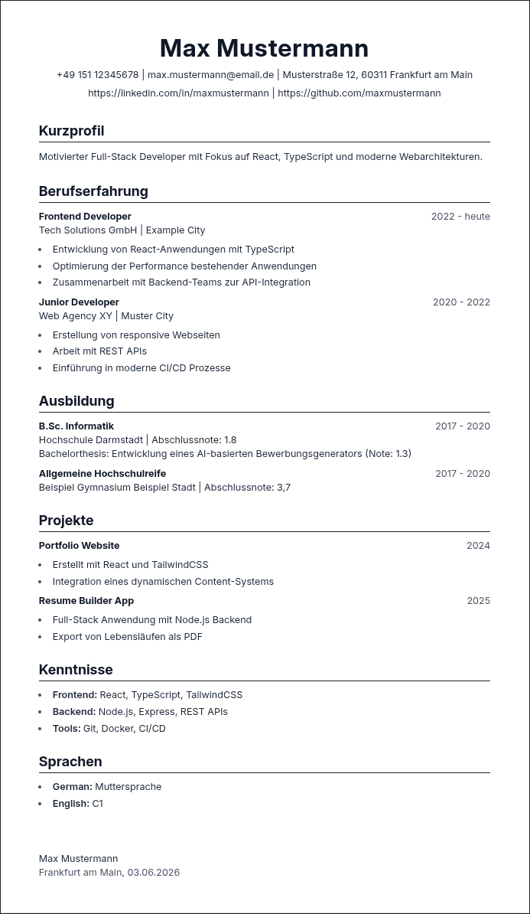
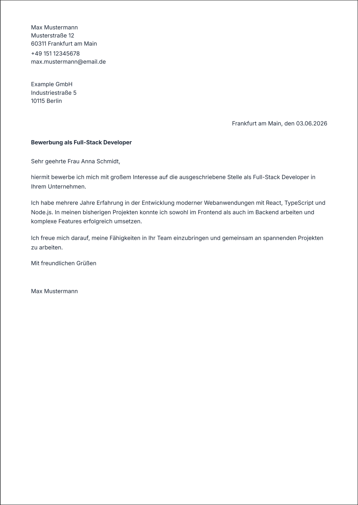

# Application Templates

> Generate professional CVs and cover letters in minutes — without worrying about layout, formatting, or design.

---

## 🚀 How to use

### 1. Setup your personal data

First, copy the example file:

```bash
cp userInfo.tsx.example userInfo.tsx
```

Then replace the example content with your own information.

---

### 2. (Optional) Add a signature image

If you want to include a signature:

* Place your image inside the `public` folder
* Set the file name in `userInfo.tsx`:

```ts
userSignatureFilename: "signature.png";
```

> Note: Both `userInfo.tsx` and the `public` folder are ignored by Git to ensure your personal data is never committed. Set `userSignatureFilename` to an empty string (`""`) if you do not want to include a signature.

---

### 3. Start the development server

```bash
npm run dev
```

Your application will be available at: [http://localhost:5173](http://localhost:5173)

---

### 4. Export your documents

* Open the website
* Navigate to **CV** or **Cover Letter**
* Use your browser’s print function
* Save as **PDF**

---

## 📄 Notes

Currently, only German versions of the CV and cover letter are available.

You can customize or extend the templates located in: `/app/pages/german`

---

## 💡 Future ideas

* Multi-language support (EN / DE)
* More CV templates (modern, minimal, creative)
* PDF export button (no browser print needed)

---

## 📸 Preview

<p align="center">
  
  
</p>
